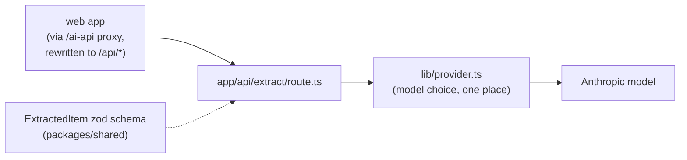

# ai — internal architecture

A thin, stateless transformer: notes in, structured action items out.
Nothing is persisted here — persistence is the api service's job.

Notes:

- **`/api/extract`** validates the `ExtractRequest` body, asks the model
  for output matching the `ExtractedItem` schema, and returns an
  `ExtractResponse`. The schema's `.describe()` strings are sent to the
  model as instructions — the shared contract literally steers the
  extraction, which is why those descriptions must stay accurate.
- **`lib/provider.ts` is the only file that knows which model runs.**
  Swapping vendors or models is a one-file change; routes and keys don't
  move.
- **Secrets stay here.** The model API key lives in this app's `.env`
  (`.env.example` documents it); the web app never sees it — another reason
  the browser goes through the proxy instead of calling vendors directly.
