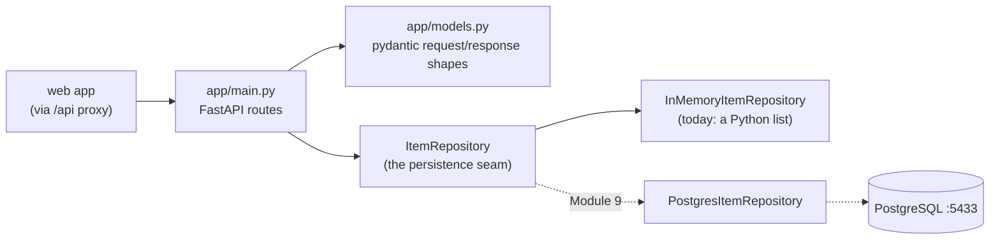

# api — internal architecture

Three layers: routes answer HTTP, the repository hides persistence, and
pydantic models validate every shape at the door. The repository is the
seam Module 9 swaps without touching a single route.

Notes:

- **Routes never hold data.** `main.py` declares endpoints, validates
  bodies against the pydantic models, and delegates to whichever
  `ItemRepository` implementation is configured — that's the entire job.
- **The seam is the point.** Module 2 hid persistence behind
  `ItemRepository` precisely so Module 9 can drop in a Postgres-backed
  implementation while the endpoints (and their tests) stay unchanged.
- **pydantic mirrors `packages/shared`.** The zod schemas are the
  TypeScript side of the contract; `app/models.py` is the Python side.
  They must agree — `docs/api-design.md` is the reference both follow.
- **Tests** (`tests/`) call the endpoints through FastAPI's test client,
  so they exercise routing + validation + repository together.
- Module 9 also adds `app/settings.py` (pydantic-settings): `DATABASE_URL`
  arrives from the environment, validated at startup.
