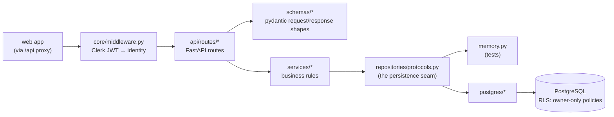

# api — internal architecture

Layered: middleware verifies identity, routes answer HTTP, services hold the
business rules, and the repository seam hides persistence — Postgres for
real, in-memory fakes for tests, swapped in one place (`app/main.py`).

Notes:

- **Middleware first** (`core/middleware.py` + `core/security.py`): every
  request outside `PUBLIC_PATHS` needs a Clerk JWT, verified locally against
  JWKS public keys. `core/request_id.py` wraps it all — every response gets
  an `X-Request-ID` and one structured access-log line.
- **Routes never hold data or rules.** They validate shapes and delegate to
  `services/`, the only layer allowed between routes and repositories.
- **The seam is the point.** `repositories/protocols.py` types the contract;
  `memory.py` (fakes) and `postgres/` (real) both satisfy it, so the whole
  API suite runs with zero infrastructure.
- **RLS is the last line**: the app connects as the low-privilege
  `note2action_app` role and announces the user per transaction; owner-only
  policies mean a forgotten filter still can't leak rows.
- **pydantic mirrors `packages/shared`.** The zod schemas are the TypeScript
  side of the contract; `app/schemas/` is the Python side. They must agree —
  `docs/api-design.md` is the reference both follow.
- **Config** (`core/config.py`, pydantic-settings): `DATABASE_URL`,
  `MIGRATIONS_DATABASE_URL`, `REPOSITORY`, `CLERK_JWKS_URL` arrive from the
  environment, validated at startup.
