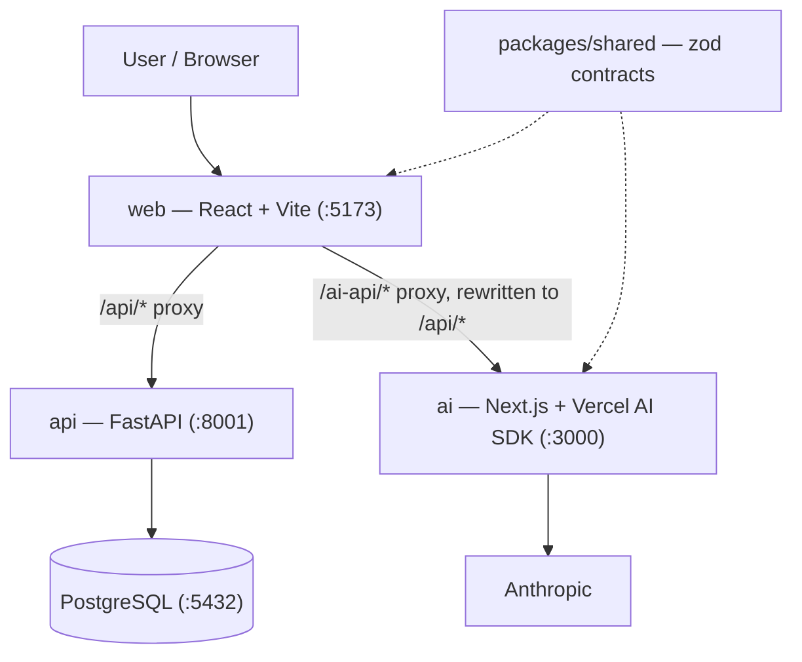
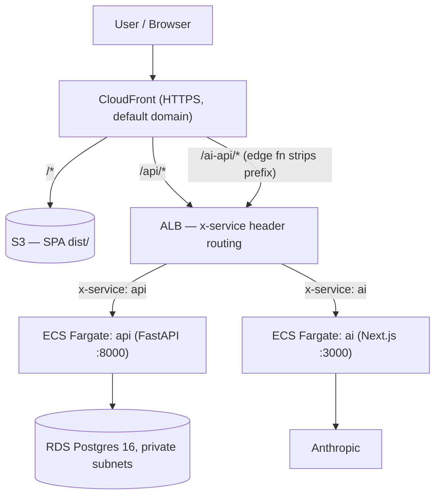

# System Architecture

The whole system, one box per service. Per-service internals live in their
own docs: [web](web.md) · [api](api.md) · [ai](ai.md).

## Local development

How to read it:

- **The browser only ever talks to the web dev server.** Vite proxies
  `/api/*` to FastAPI and `/ai-api/*` to the AI app (rewriting the prefix to
  `/api/*` on the way through), so there's no CORS in dev and the frontend
  never hardcodes a backend origin.
- **The services never call each other.** The browser orchestrates: it asks
  the AI app to extract, then asks the API to persist.
- **`packages/shared` is the contract**, imported by web and ai; the API
  mirrors the same shapes in pydantic. Dashed lines = build-time dependency,
  not a network call.
- **Both backends verify Clerk JWTs independently** (JWKS, no shared
  secret), and Postgres Row-Level Security enforces per-user isolation even
  if an application-level filter is forgotten.

## Production (AWS)

The same topology with CloudFront playing the Vite proxy's role — defined in
`infra/` (Terraform), deployed by CI on every merge to `main`:

- **One CloudFront URL = same origin**, so the SPA's relative fetches work
  unchanged and no CORS exists in prod either.
- The `x-service` header is routing, not auth — a security group restricts
  the ALB to CloudFront's IP prefix list, and each service verifies Clerk
  JWTs itself.
- Full design + trade-offs: `docs/superpowers/specs/2026-08-26-aws-hosting-design.md`
  and `docs/adr/`.
