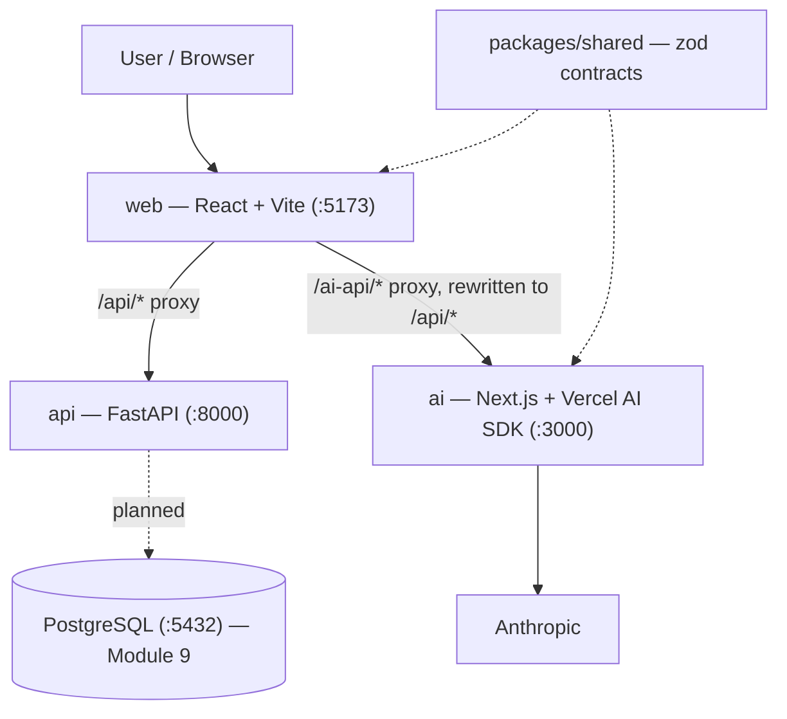

# System Architecture

The whole system, one box per service. Per-service internals live in their
own docs: [web](web.md) · [api](api.md) · [ai](ai.md).

How to read it:

- **The browser only ever talks to the web dev server.** Vite proxies
  `/api/*` to FastAPI and `/ai-api/*` to the AI app (rewriting the prefix to
  `/api/*` on the way through), so there's no CORS in dev and the frontend
  never hardcodes a backend origin.
- **The services never call each other.** The browser orchestrates: it asks
  the AI app to extract, then (from Module 10) asks the API to persist.
- **`packages/shared` is the contract**, imported by web and ai; the API
  mirrors the same shapes in pydantic. Dashed lines = build-time dependency,
  not a network call.
- **Postgres is dashed** because it doesn't exist yet — Module 9 adds it,
  implementing `docs/database-schema.md`.
