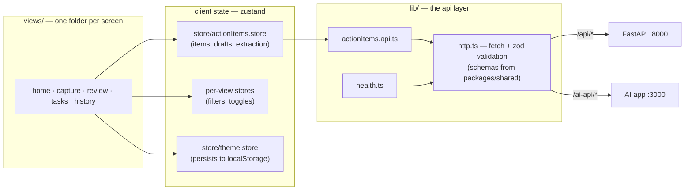

# web — internal architecture

The rule the whole app follows: **views never touch the network.** A view
reads state from a store; store actions call the api layer; only `http.ts`
actually fetches. Every arrow below points one direction — data requests
flow left to right, and results flow back through the same layers.

Notes:

- **Components** (`components/app`, `components/ui`) render what views hand
  them; the shared ones read the same stores. They add no new arrows.
- **`actionItems.store` owns the extraction flow** — it calls
  `extractActionItems()` itself so an in-flight extraction survives
  navigating away from Capture. That's why the arrow to the api layer
  leaves the store, not a view.
- **`http.ts` validates every response** against the shared zod schema
  before returning it — a drifting backend fails loudly at this boundary
  instead of deep inside a component.
- **Server state vs client state:** the health dot flows through TanStack
  Query (`health.ts`); everything else is zustand today. Module 10 moves
  item persistence onto TanStack Query mutations and shrinks the store to
  true client-only state.
