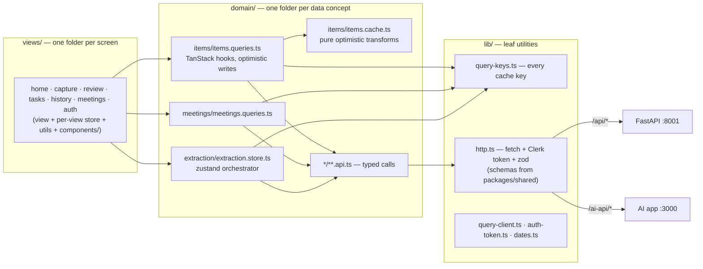

# web — internal architecture

Four layers, arrows point one direction: **views → domain → lib**, with
components rendering whatever views hand them. Views never touch the
network; domain modules never import views; `lib/` imports nothing above
itself. Only `lib/http.ts` actually fetches.

Notes:

- **Server state lives in TanStack Query, client state in zustand.** Items
  and meetings are server state — cached under keys from
  `lib/query-keys.ts`, fetched through the domain `*.api.ts` modules.
  Zustand holds only what the server doesn't know: draft text, open
  modals, filters, theme.
- **Writes are optimistic** (request-paths.md §2): `items.queries.ts`
  mutations snapshot the cache, apply the matching pure transform from
  `items.cache.ts` instantly, then reconcile from the server's response —
  or roll back and toast (`components/app/toaster.tsx`) on failure.
- **Cache keys live in `lib/query-keys.ts`, below the domains** — so
  cross-domain invalidation (deleting an item refreshes meeting counts)
  never imports another domain's hook module.
- **`extraction.store.ts` is the one orchestrator**: it calls the AI
  extraction, then persists via `meetings.api.ts` and invalidates both
  caches. It's a store, not a component, so an in-flight extraction
  survives navigating away from Capture.
- **`http.ts` guards the border**: attaches the Clerk session token
  (via `lib/auth-token.ts`) and validates every response against the
  shared zod schema — a drifting backend fails loudly here, not deep
  inside a component.
- **Components add no new arrows.** `components/app` may read domain
  hooks; `components/ui` (shadcn) imports only `lib/utils`.
