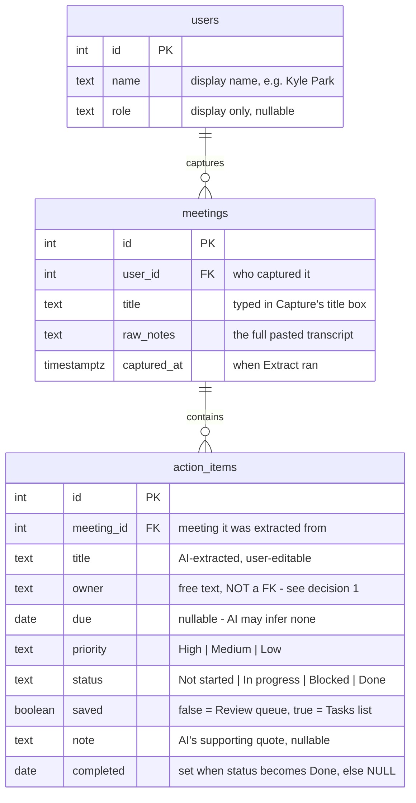

# Database Schema — note2action

Module 8 deliverable. Designed on paper from the screen-by-screen data
inventory (every **stored** field became a column; every **derived** field
deliberately did not). Implemented for real in Module 9 as SQLAlchemy models
plus an initial Alembic migration.

## ER diagram

Reading the lines: `||--o{` means one-to-many — one user captures many
meetings; one meeting contains many action items. Deleting a meeting should
cascade to its items (`ON DELETE CASCADE`); deleting a user is out of scope
until auth exists.

## Decisions and why

1. **`owner` is a text column, not a foreign key to `users`.** Owners are
   people _mentioned in meeting notes_ — three of the five in today's list
   can't log in and never will. A foreign key would force every name the AI
   extracts to exist as an account first, which breaks extraction. Revisit
   only if owners ever need to log in and see "their" items.

2. **Integer primary keys, not UUIDs.** The frontend already types `id` as
   `number`, and Postgres `GENERATED ALWAYS AS IDENTITY` is the simplest
   thing that works. UUIDs earn their keep when ids are generated client-side
   or across services — neither applies here.

3. **`due` and `completed` are nullable `date`s.** The frontend uses `""`
   for "no date"; the database uses `NULL`. The API layer translates at the
   boundary (empty string never enters the database).

4. **`completed` is stored, not derived.** It's the timestamped fact "when
   was this closed" — the History screen's week grouping and the on-time
   stat both depend on it. Invariant the app maintains (and a `CHECK` can
   enforce): `completed IS NOT NULL` exactly when `status = 'Done'`.

5. **`priority` and `status` are constrained text**, via `CHECK` constraints
   (or Postgres enums) matching the four statuses and three priorities the
   UI offers. Constrained text keeps migrations simpler than native enums
   while still rejecting garbage.

6. **`users` stays minimal.** One row (Kyle) seeds it until Module 12, where
   Clerk auth adds a `clerk_user_id` column via a new migration — that
   schema _change_ is the planned migration lesson.

## Columns that exist because of the UI

- `saved` — the Review → Tasks workflow boundary
- `note` — the supporting quote under each Review card
- `completed` — History's week grouping and on-time stat
- `meetings.raw_notes` — the Recent-captures strip and its transcript modal

## Deliberately NOT columns (derived on demand)

| UI element                                  | Derived from                                  |
| ------------------------------------------- | --------------------------------------------- |
| "N items to review" / "N open tasks" (Home) | counts over `saved` + `status`                |
| Tasks section grouping                      | `status`                                      |
| Owner initials circle                       | `owner`                                       |
| History week groups ("Week of Aug 4")       | `completed`                                   |
| All three History stat tiles                | counts over `status`, `completed`, `due`      |
| "across 4 meetings" subtitle                | `COUNT(DISTINCT meeting_id)` — honest at last |
| Word count (Capture)                        | `raw_notes`                                   |
